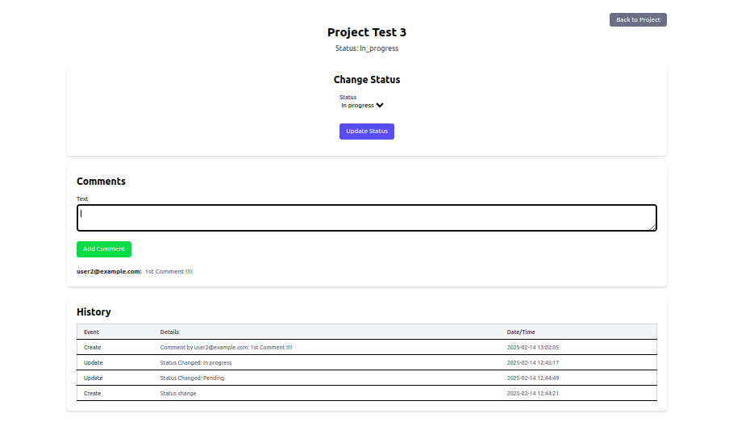

# 📜 Project History Tracker 📜

A Ruby on Rails application for tracking project status changes and facilitating discussions through comments.  This application keeps a detailed log of all interactions, providing a comprehensive history for each project.

## 🧭 Contents

- [Tech Stack 🛠️](#tech-stack)
- [Setup ⚙️](#setup)

## 🛠️ Tech Stack

### 💎 Ruby

  Installed Ruby Version:
- **Ruby 3.4.1**: The dynamic, open source programming language at the heart of our Rails development.

  ### ⚙️ Ruby Version Management

  We recommend using a Ruby version manager for a smoother development experience.  Here are two popular options:

  **RVM (Ruby Version Manager):**
  - `curl -sSL https://get.rvm.io -o rvm.sh`
  - `rvm install ruby-3.4.1` (or your desired Ruby version)

  **rbenv:**
  - `curl -fsSL https://github.com/rbenv/rbenv-installer/raw/HEAD/bin/rbenv-installer | bash`
  - `rbenv install 3.4.1` (or your desired Ruby version)

### 🛤️Rails

  Installed Rails Version:
- **Rails 7.1.5**: The robust and elegant web framework that empowers our backend.

### 🐘PostgreSQL

  Installed PostgreSQL Version:
- **PostgreSQL**: Our reliable and powerful relational database management system.

## 🧰Prerequisites

Before you can run this application, ensure you have the following installed:

- Ruby 3.4.1 (See installation instructions above)
- Rails 7.1.5

## ⚙️ Setup

Let's get this project up and running on your local machine!

1. **Clone the Repository:**
   ```bash
   git clone https://github.com/devmurariror/project_history_tracker
2. **Navigate to the Project Directory:**
   ```bash
   cd project_history_tracker
3. **Install Dependencies:**
   ```bash
   bundle install
4. **Configure the Database:** Create a `database.yml` file (if it doesn't exist) in the `config` directory. Update the `username` and `password` with your PostgreSQL credentials. A sample `database.yml` might look like this (adjust as needed):

   ```yaml
   development:
     adapter: postgresql
     encoding: utf8
     database: project_history_tracker_development
     pool: 5
     username: your_username
     password: your_password
     host: localhost

   test:
     adapter: postgresql
     encoding: utf8
     database: project_history_tracker_test
     pool: 5
     username: your_username
     password: your_password
     host: localhost
5. **Set up the Database:**
   ```bash
   rails db:setup
6. **Start the Development Server:**
   ```bash
   ./bin/dev

 **Track Model Changes with PaperTrail:**
   Track changes to your models, for auditing or versioning. See how a model looked at any stage in its lifecycle, revert it to any version, or restore it after it has been destroyed.

 *Some Screenshots:*
      
